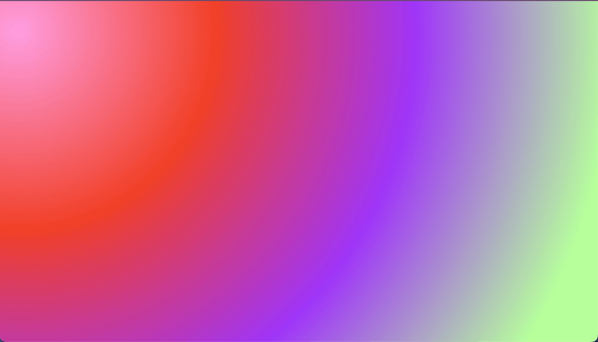
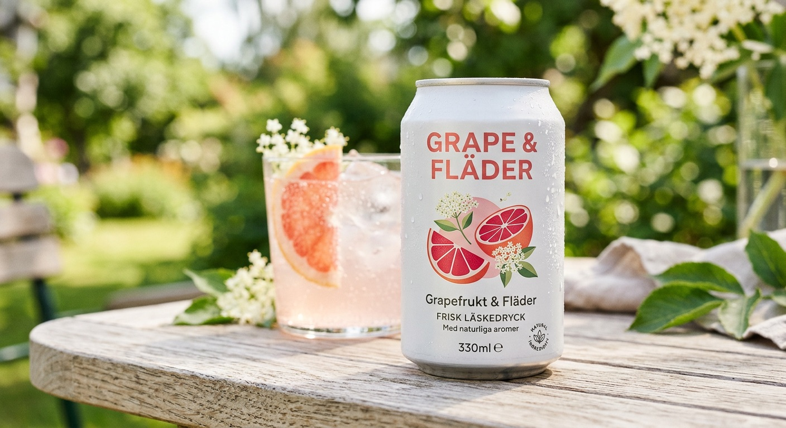

# Individuell uppgift: Grafiska Verktyg

## Kort om uppgiften
En praktisk fördjupning i filformat och verktyg som ofta angränsar frontendutveckling bestående av två delar. 

### Del 1: Animera SVG-fil
[Se demo live](https://medieinstitutet.github.io/fed25d-grafiska-verktyg-individuell-linasvard/)

#### Beskrivning
I del ett skulle jag skapa en egen SVG-fil i valfritt program och i detta fall har jag använt Adobe Illustrator där jag skrivit ut texten och gjort om den till vektografik. Sparade ner den som SVG för att komma åt svg-tagen och dess "paths".

Animationen är enbart byggd med GSAP i JavaScript och föreställer de tre order "Make It Pop!" inflygandes från vänster, höger och nedifrån på en färgglad gradient. 

### Del 2: Generera AI bild
#### Beskrivning 
I del två fick jag generera en valfri AI-bild som ev. skulle kunna användas som placeholder bild för ett frontend-projekt. Här gavs fri kreativitet och en lista på rad olika verktyg. Jag använde Adobe Firefly för min bild.
Bilden är tänkt att användas som en placeholder för en herobild, exempelvis till en sommarlansering för läskeföretag. Den lämpar sig bäst för desktop läge men skulle kunna anpassa sig till mobil. 

Prompten till Adobe FireFly
> "Kan du generera en produktbild för en läskedryck som smakar grapefrukt och fläder. Designen ska vara modern och enkel och kännas fräsch!"

#### Och fick resultatet jag fick:

